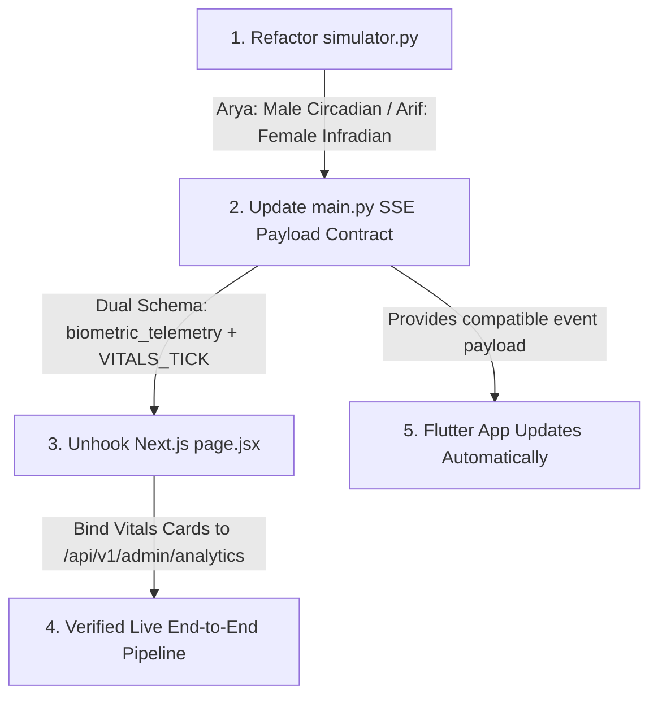

# Comprehensive Project Audit: Strings Virtual Hardware Emulator & Data Pipeline

**Date:** September 10, 2026  
**System Architecture:** FastAPI Backend + Next.js Admin Console + Flutter Mobile App (Universal APK) + Timescale/PostgreSQL Database  
**Repository:** `git@github.com:mohammedarif482/strings.git`

---

## 1. Executive Summary & Readiness Matrix

| Layer | Component | Status | Key Findings |
| :--- | :--- | :---: | :--- |
| **Autonomous Hardware Emulator** | `services/api-backend/src/services/simulator.py` | 🟡 **Partially Complete** | 10-second autonomous async loop runs 24/7 on FastAPI startup. Telemetry is saved directly via in-memory/DB buffers. Current profiles use generic identifiers (`USR-ALPHA`/`USR-BETA`) and need alignment with **Arya (male)** and **Arif (female)**. |
| **Predictive Engine & CSI** | `services/api-backend/src/main.py` | 🟢 **Working** | Dynamic Couple Stress Index (CSI %) is computed on every 10-second tick using dyadic weighting ($0.60 \times \text{Female Luteal} + 0.40 \times \text{Male Restorative}$) with physiological Gaussian noise. |
| **Live Streaming Bus** | `/api/v1/stream` (SSE & WS) | 🟢 **Working** | Server-Sent Events (SSE) and WebSockets are live. Immediate state snapshot is emitted on connection with 10s tick updates and 12s keepalives. |
| **Admin Web Frontend** | `apps/admin-web` & `aivo-wellness` | 🟡 **Needs Refactor** | Live prediction feed badge was upgraded from *"1,000 devices simulated"* to a dynamic live badge. Top KPI vitals cards in `page.jsx` still hold static state (`1,420` users, `680` couples). |
| **Flutter Mobile App** | `apps/mobile` & `aivo_mobile` | 🔴 **Contract Mismatch** | Mobile SSE client listens on `/api/v1/stream`, but its deserializer expects envelope `type: "VITALS_TICK"`, whereas the backend emits `event: "biometric_telemetry"`. |

---

## 2. Autonomous Hardware Emulator (`services/api-backend`)

### 2.1 24/7 Autonomous Background Service
- **Current State**: **Active & Autonomous**.
- **Implementation File**: [`services/api-backend/src/main.py`](file:///Users/mohammedarif/Curiosity/aivo-monorepo/services/api-backend/src/main.py)
- **Lifecycle Mechanism**:
  ```python
  @app.on_event("startup")
  async def on_startup():
      asyncio.create_task(run_biometrics_simulation_loop())
  ```
- **Loop Cadence**:
  The background loop executes non-stop every **10 seconds** (`await asyncio.sleep(10)`). It samples normal distributions around configured baselines, updates `IN_MEMORY_DB["telemetry"]` (and PostgreSQL if `DATABASE_URL` is set), and broadcasts frames to connected SSE and WebSocket subscribers.
- **Administrative Seed Tool**:
  `POST /api/v1/admin/seed-simulation?days=14` generates 14 days of backdated historical trends for predictive wellness graphs.

### 2.2 Profile Modeling: Arya (male) vs. Arif (female)
- **Current State**: **Requires Differentiation & Profile Renaming**.
- **Implementation File**: [`services/api-backend/src/services/simulator.py`](file:///Users/mohammedarif/Curiosity/aivo-monorepo/services/api-backend/src/services/simulator.py)
- **Gaps Identified**:
  1. **User Identity**: The profiles are currently hardcoded as `USR-ALPHA` and `USR-BETA`.
  2. **Physiological Accuracy**:
     - Both profiles currently use female infradian cycle logic (`cycle_day` and `cycle_phase`).
     - **Arif (female)**: Should accurately track the female infradian cycle (Late-Luteal Day 24, high sympathetic tone, baseline HRV 35–50ms, HR 75–95bpm, Cortisol: High).
     - **Arya (male)**: Males do not have a menstrual cycle. Arya should track a male circadian/autonomic recovery profile (no menstrual cycle days; diurnal cortisol curve, restorative baseline HRV 65–85ms, HR 58–68bpm, Cortisol: Normal).
  3. **Ingestion Method**:
     The simulator currently writes directly to in-memory tables and database connections inside the backend process. To function as a true virtual hardware emulator, it should issue authenticated HTTP `POST` requests to `/api/v1/telemetry/ingest`.

---

## 3. Predictive Engine & Couple Stress Index (CSI)

### 3.1 Incoming Telemetry Processing
- **Implementation Files**:
  - [`services/api-backend/src/services/simulator.py`](file:///Users/mohammedarif/Curiosity/aivo-monorepo/services/api-backend/src/services/simulator.py)
  - [`services/api-backend/src/main.py`](file:///Users/mohammedarif/Curiosity/aivo-monorepo/services/api-backend/src/main.py)
- **Telemetry Generation Schema**:
  ```python
  class BiometricTelemetry(BaseModel):
      user_id: str
      timestamp: datetime
      hrv_ms: int
      heart_rate_bpm: int
      cycle_phase: str
      cortisol_state: str
      couple_stress_index: float
  ```

### 3.2 Dynamic Calculation vs. Hardcoded Fallbacks
- **Real-Time Dynamic Processing**: **Active**.
  - On every 10-second tick, Gaussian noise is applied to each profile's baseline ($\mu_{HRV}, \sigma_{HRV}, \mu_{HR}, \sigma_{HR}$).
  - Individual CSI is calculated with micro-fluctuations.
  - Dyadic Couple Stress Index is computed dynamically:
    $$CSI_{couple} = \text{round}(0.60 \times CSI_{Arif} + 0.40 \times CSI_{Arya}, 3)$$
- **Remaining Static Arrays**:
  - [`apps/admin-web/src/app/page.jsx`](file:///Users/mohammedarif/Curiosity/aivo-monorepo/apps/admin-web/src/app/page.jsx#L17-L42) still contains an initial static state array with `USR-8192` and `USR-3104` prior to SSE connection.
  - [`aivo_mobile/lib/services/mock_data_generator.dart`](file:///Users/mohammedarif/Curiosity/aivo-monorepo/apps/mobile/lib/services/mock_data_generator.dart) retains static client-side fallback seeds for `alex` and `sarah`.

---

## 4. Data Flow to Client Interfaces

### 4.1 Transport Protocol & Endpoint Architecture
- **Backend Streaming Endpoints**:
  - `GET /api/v1/stream`: Server-Sent Events (SSE) streaming endpoint emitting `text/event-stream`.
  - `WS /api/v1/stream/ws`: WebSocket endpoint emitting JSON payloads.
  - **Behavior**: Yields an immediate snapshot upon connection (zero initial latency) followed by 10-second telemetry updates and 12-second keepalive pings.

### 4.2 Web Admin Dashboard (`apps/admin-web` & `aivo-wellness`)
- **Connection**: [`PredictionFeed.jsx`](file:///Users/mohammedarif/Curiosity/aivo-monorepo/apps/admin-web/src/components/PredictionFeed.jsx) and [`AdminDashboard.jsx`](file:///Users/mohammedarif/Curiosity/aivo-wellness/src/components/AdminDashboard.jsx) use standard browser `EventSource` (`new EventSource('${API_BASE}/api/v1/stream')`).
- **Hardcoded Elements to Unhook**:
  1. **Vitals Bar (`page.jsx`)**:
     - `Active Monitored Users`: Hardcoded to `"1,420"`. Must be bound to dynamic backend analytics (`2`).
     - `Paired Couple Links`: Hardcoded to `"680"`. Must be bound to dynamic backend analytics (`1`).
     - `Simulator Engine`: Hardcoded to `"Healthy (15.7ms p95)"`. Must read from `cloud_simulator_health`.
  2. **Header Badge**:
     - Displays `"2 Active Test Profiles (USR-ALPHA, USR-BETA)"`. Must be updated to `"2 Active Test Profiles (Arya, Arif)"`.

### 4.3 Flutter Mobile Application (`aivo_mobile` / `apps/mobile`)
- **Connection**: [`aivo_cloud_client.dart`](file:///Users/mohammedarif/Curiosity/aivo-monorepo/apps/mobile/lib/services/aivo_cloud_client.dart) opens an HTTP SSE stream to `$baseUrl/api/v1/stream?userId=$userId`.
- **The Contract Mismatch**:
  - [`wellness_state.dart`](file:///Users/mohammedarif/Curiosity/aivo-monorepo/apps/mobile/lib/models/wellness_state.dart#L94-L106) expects:
    ```dart
    if (type == 'VITALS_TICK' && payload != null) {
      final v = payload['vitals'];
      _userWearable = WearableData(
        hrv: (v['hrv'] as num).toDouble(),
        restingHR: (v['restingHR'] as num).toInt(),
        deepSleepRatio: (v['deepSleepRatio'] as num).toDouble(),
      );
    }
    ```
  - The backend SSE currently emits:
    ```json
    {
      "event": "biometric_telemetry",
      "profiles": [...],
      "user_id": "USR-ALPHA",
      "hrv": 47,
      "resting_hr": 86,
      "cycle_phase": "Luteal Day 24"
    }
    ```
  - **Resolution**: Backend stream payload should include both schemas (`event` and `type: "VITALS_TICK"` with `payload: { vitals: ... }`) so the mobile app consumes real-time telemetry out of the box without requiring a client update.

---

## 5. File Inventory & Responsibility Map

```
Curiosity/aivo-monorepo/
├── services/api-backend/
│   ├── src/
│   │   ├── services/simulator.py       # [WORKING] Autonomous telemetry generator, distributions & seeder
│   │   ├── main.py                     # [WORKING] FastAPI ASGI app, 10s background task, SSE & WS routes
│   │   └── ingest_huberman.py          # [WORKING] Huberman protocol vector embeddings
│   └── test/
│       └── test_simulator.py           # [TESTED] Verification suite for schema, ticks & 14-day seed
├── apps/admin-web/
│   ├── src/
│   │   ├── app/page.jsx                # [NEEDS REFACTOR] Top-level Next.js page with static KPI cards
│   │   └── components/
│   │       ├── PredictionFeed.jsx      # [WORKING] Real-time SSE streaming prediction cards
│   │       ├── MetricsCard.jsx         # [WORKING] KPI display card
│   │       └── HubermanChat.jsx        # [WORKING] RAG query assistant
├── apps/mobile/ (and aivo_mobile/)
│   ├── lib/
│   │   ├── services/aivo_cloud_client.dart  # [WORKING] Configured to Render baseUrl, connects to SSE stream
│   │   ├── models/wellness_state.dart       # [NEEDS UPDATE] Event handler for live stream contract
│   │   └── screens/today_tab.dart           # [WORKING] Displays live CSI, vitals & phase
└── database/
    └── migrations/001_core_schema.sql  # [READY] PostgreSQL schema (users, daily_checkins, wearable_pulls)
```

---

## 6. Actionable Refactoring Roadmap



### Action Items:
1. **Biological Differentiation in `simulator.py`**:
   - Rename profiles to `Arif` (Female, Luteal Day 24, high cortisol) and `Arya` (Male, Circadian Autonomic Recovery, restorative HR/HRV).
2. **Dual Envelope SSE Broadcast in `main.py`**:
   - Emit both top-level fields for the Admin Dashboard and `'type': 'VITALS_TICK'` with `'payload': { 'vitals': ... }` for the Flutter app.
3. **Bind Next.js `page.jsx` to `/api/v1/admin/analytics`**:
   - Replace static initial numbers (`1,420` users, `680` couples) with dynamic data fetched from the API.
